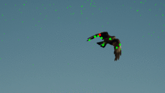

# Particle Filter for video object tracking
Vectorized PyTorch implementation of Particle Filter algorithm for video object tracking based on target color.

## Examples:
### Occlusions:

### Low color contrast:

### High color contrast:

